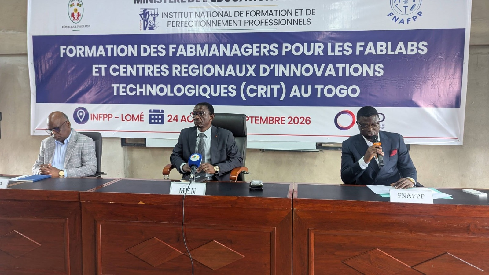

 # Journal — lUNDI 24 août 2026 (rédigé par : ADAM Bilali)
- Arrivée des autorités à 7h00 à l'INFPP pour la formation des fabmagers des lycées,collèges scientifique du togo.
- Cérémonie d'ouverture de la formation lancée par le Ministre de l'éducation nationale

- Initiation sur la Documentation numérique
- Initiation au langage MarcDown

## Appris
- Les syntaxe du langage MarcDown
- La documentation se fait sur la platforme en ligne Github 
- Familiarisation avec le logiciel VS Code
- Ouverture d'un compte sur le site Github
