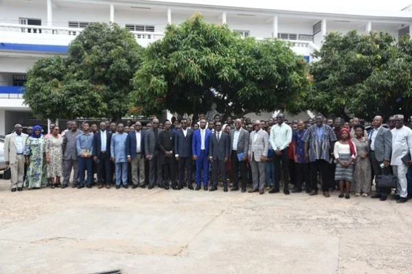

# JOURNAL DU 24 AOUT 2026
## Compte rendu de la première journée de formation
- cérémonie d'ouverture

- Intervention du Ministre

- Photo d'ensemble

- Présentation de la documentation
- Consigne
- conclusion
## Appris
- comment rédiger un document avec les logiciels VSCODE et GITHUB
## Ratté
- Dans un prémier temps j'avais ratté comment rédigé c'étais un peu compliqué pour moi comme c'est ma prémière fois d'utiliser ces logiciels
## Décidé
- Je pense que cette formation est vraiment utile pour moi
## A Faire demain