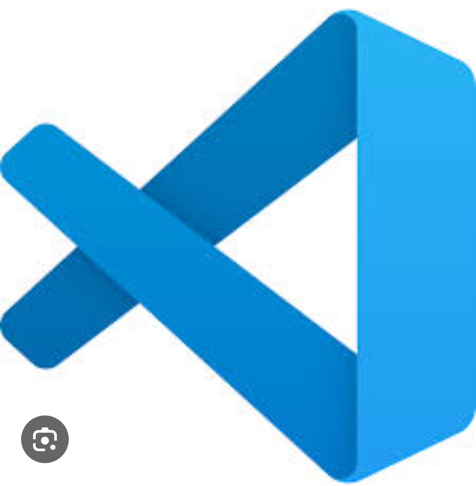
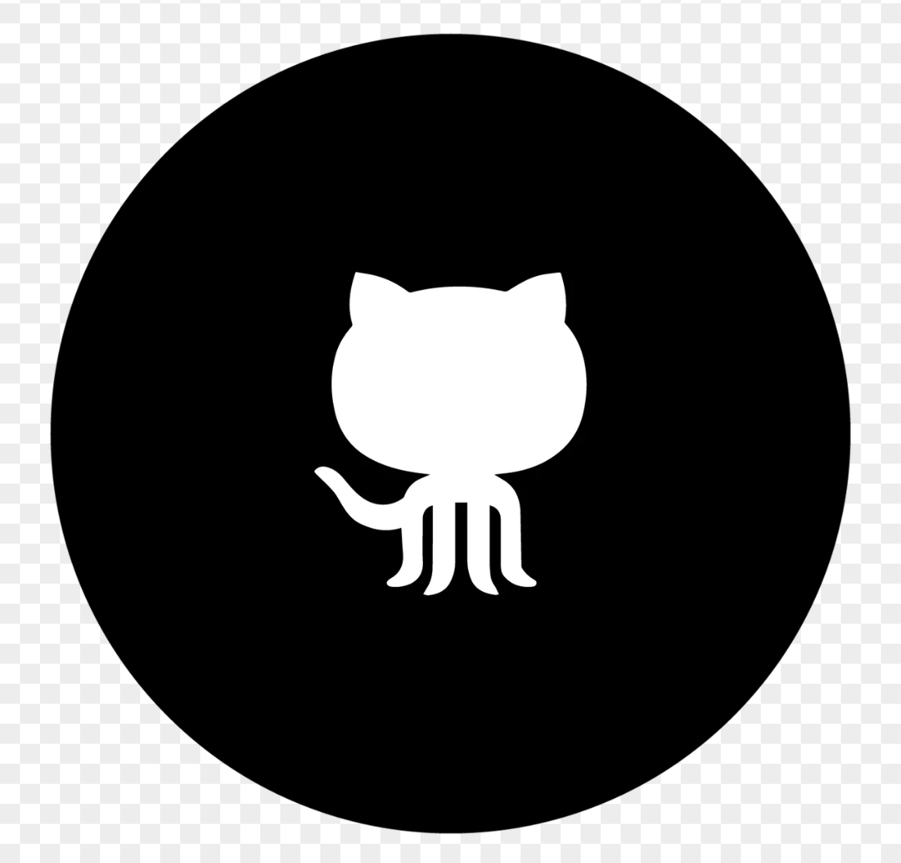

# Journal du 25 AOUT 2026 Rédigé par ADAM Bilali
## Fait d'aujourd'huid :
- Nous avons continuer l'etude de redaction des documents avec les logiciels VSCODE et GITHUB

- Ensuite nous avons suivi un cours intitulé: DECOUVERTE DU RESEAU FABLAB ET DE SA CHARTE
## Appris
- Le nom du premier fablab
- Comment apprendre à fabriquer
- Ce qu'un laboratoire doit avoir pour une meilleur formation des éleves.
## Décidé
Je dirais que la formation est toujours utile et important pour moi
## A Faire demain