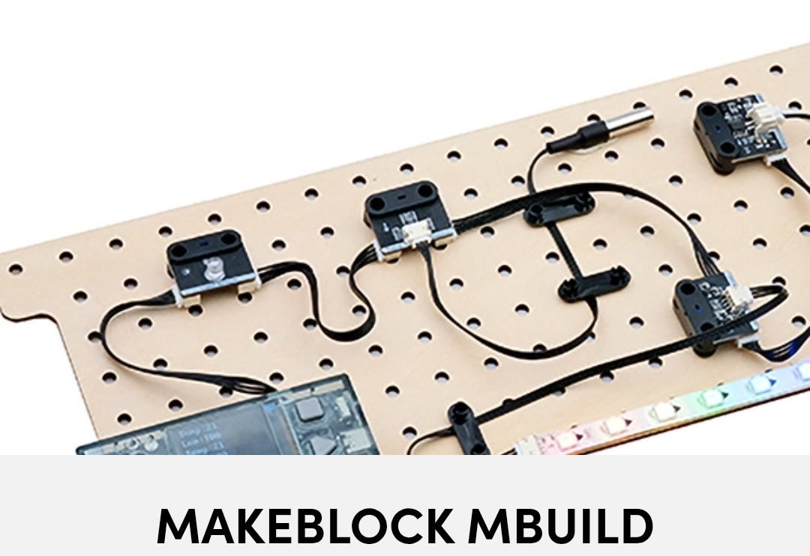

## Journal du 28 Aout 2026 Rédigé par ADAM Bilali
## Fait d'aujourd'hui :
- Passage dans l'atelier découpe laser 2D
- Passage dans l'atelier impession 3D : Installation du logiciel Foldable phone stand Bambu
- Passage dans la salle Electronique : Etude avec le logiciel mBuild pour programmer

- Installation du logiciel Fusion suivi du création du compte sur Autodesk
## Appris :
- Paramètrage du ficher foldable stand Bambu
- Utilisation du filament PETG
- comment Programmer le cyber pi pour que lorsque la luminosité est à 25 les leds s'allument.
## Ratté :
j'ai ratté comment choisir le filament pour l'impression en 3D avec la machine disponible.
## Corrigé :
- J'ai fait appel au Formateur et cela fut fait.
## Décidé :
Je pense que la formation est toujours utile pour moi.
## A Faire demain :