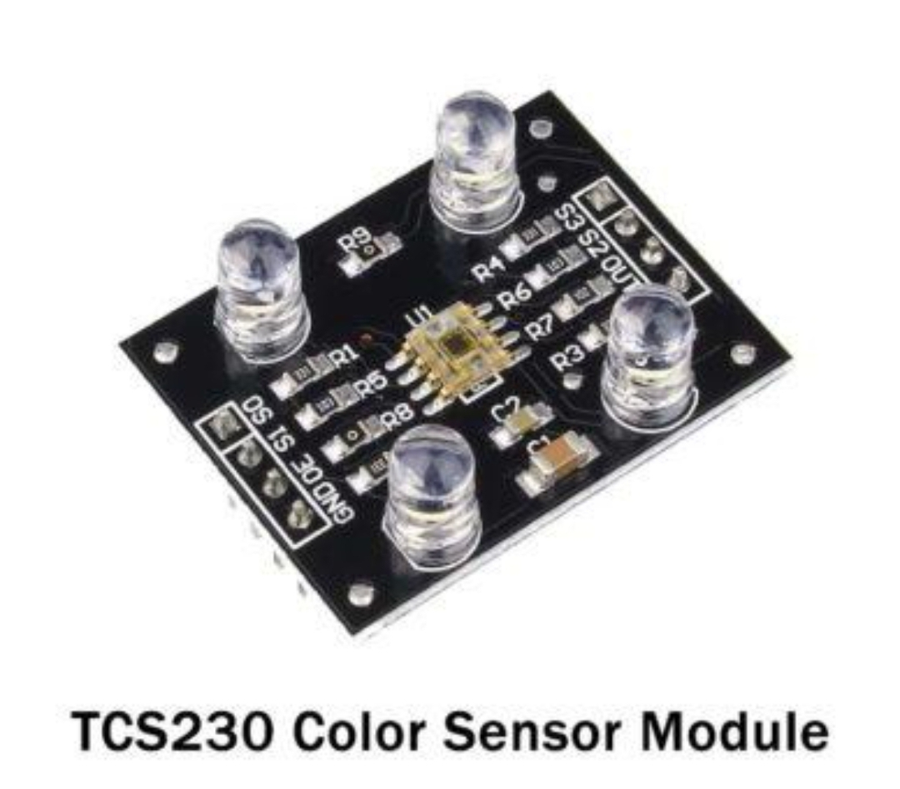
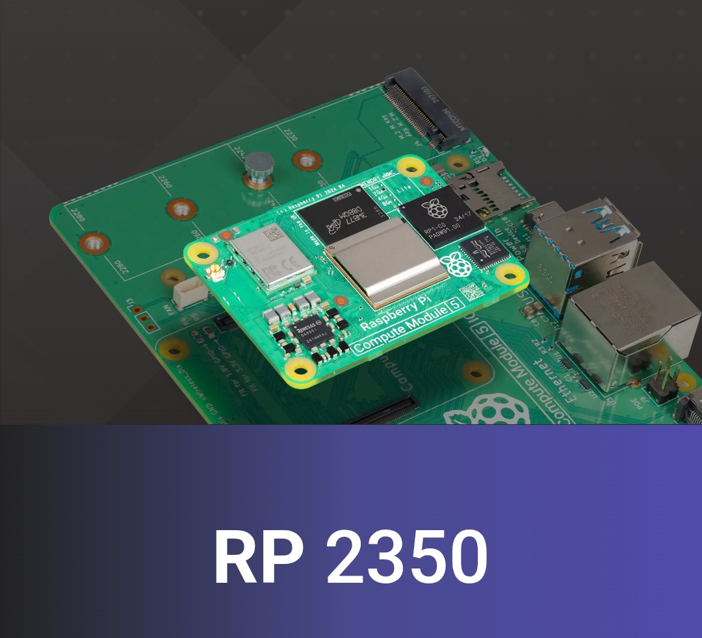

## Journal du 29 Aout 2026 Rédigé par ADAM Bilali
## Fait d'aujourd'hui :
- Nous avons formé des groupes de travail pour des projets que nous aurons à présenter dans les jours à venir. Le projet propre à notre groupe était P026 : convoyeur à bande instrumenté. 
- Nous avons présenté le projet à nos formateurs et le reste de nos collegues. le projet a été retenu et nous avons commencé.
## Appris :
- Capteur de présence pour lancer le bras du trieur
- Capteur de couleur TCS230 pour le robot tireur de couleur

- Capteur de vitesse pour mesurer la vitesse de la bande en m/s
- Cellule de pesée pour peser chaque objet en passant.
- Capteur de proximité inductif pour compter les pièces métalliques.
- Capteur de température pour surveiller si le moteur chauffe.
- le microcontroleur : Cyber Pi pour faire de l'IA + Vision.
## Ratté :
j'ai ratté le choix du microcontroleur; j'avais utilisé Raspberry Pi.

## Corrigé :
J'ai rapidement remplacé le Raspberry Pi par le cyber Pi Pour une programmation un peu réfléchi.
## Décidé :
Je pense que la formation est toujours utile pour moi.
## A faire demain :