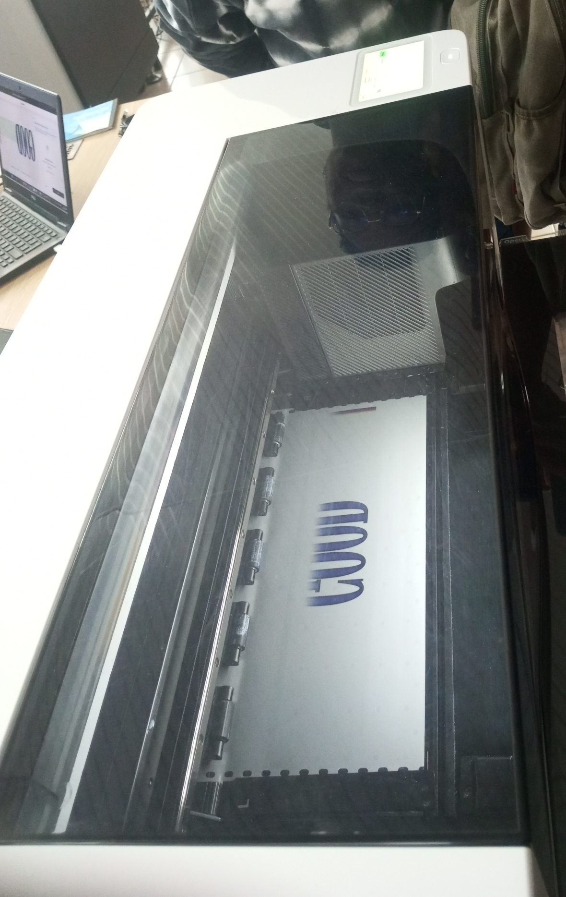

## Journal du 01 Septembre 2026 Rédigé par ADAM Bilali
## fait d'aujourd'huit :
- Utilisation du logiciel Xtools pour imprimer les images sur du tissu
- Impression DTF sur xtools

- Passage dans la salle Electronique : Maitriser de la plaquette SK10; 
- cablage d'un circuit programmé et téléverser par arduino UNO

- Etude de conception de pièces avec le logiciel Fusion Autodesk

## Appris :
- comment brancher un dipole sur la plaquette SK10
- comment téléverser le code avec le logiciel arduino sur la plaqette arduino UNO
## Ratté :
j'avais prémièrement ratté les données de production de la pièce.
## Corrigé :
j'ai fait appel au formateur qui m'a rapidement montré les vrais valeures et ca été corrigé. 