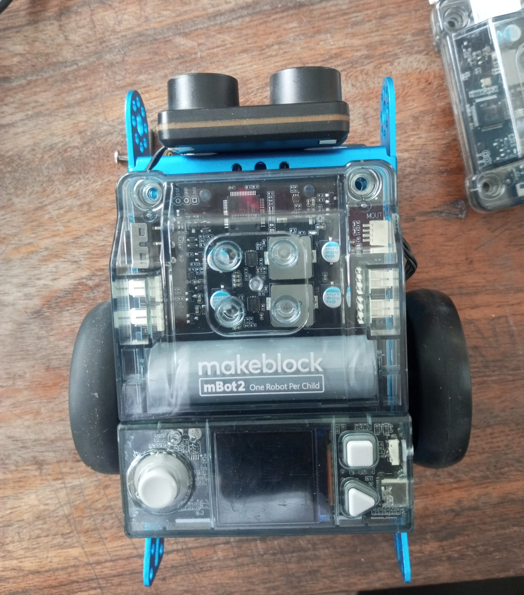

## Journal du 02 Septembre 2026 Rédigé par ADAM Bilali
## Fait d'aujourd'huit :
- Etude d'algorithme

- Etude du logiciel mBot2 pour monter; programmer et faire avancer les robots dans les bons sens.

## Appris :
- comment monter et démonter les différents parties d'un robot
##  Ratté :
j'avais ratté comment monter les pieces pour avoir la finalité du robot
## Corrigé :
j'ai appélé le formateur; il m'a rapidement montré comment faire et ca été corrigé.
## Décidé :
Je pense que la formation est toujours utile pour moi.
## Travail à faire demain :
