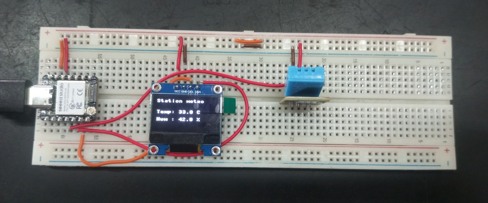

## Journal du 05 Septembre 2026 Rédigé par ADAM Bilali
## Fait d'aujourd'huit :
- Utilisation du micro python pour programmer la carte XIAO ESP32S3
- Cablage du schema de fonctionnement avec la plaquette SK10

## Appris :
- comment faire la connection sur la plaquette.
- Les différents composants tels que :
- Le capteur de température DHT22
- Ecran OLED SSD1306
- Microcontroleur XIAO ESP32S3
## Ratté :
comment lier les différents composants sur la plaquette pour avoir la fonctionnalité
## Corrigé :
j'ai appélé le formateur et cela fut bien fait.
## Décidé :
Je pense que la formation est toujours utile pour moi.
## A faire demain