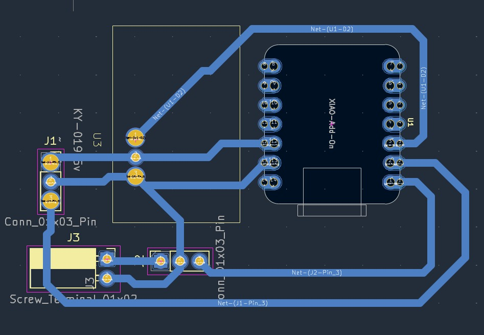

# Journal — Mercredi 16 septembre 2026 (rédigé par : ADAM Bilali)

### ETUDE DE PROJET: Convoyeur à bande avec poste de marquage
## Fait aujourd'hui :
- Suite de cablage et tests : Cablage complet de PCB + moteur + Capteur + tampon.
- Soudure des composants sur le PCB et debut de la finition du projet
 
##  Appris du jour :

## Logiciels utilisé:
- Thonny
- Kicard