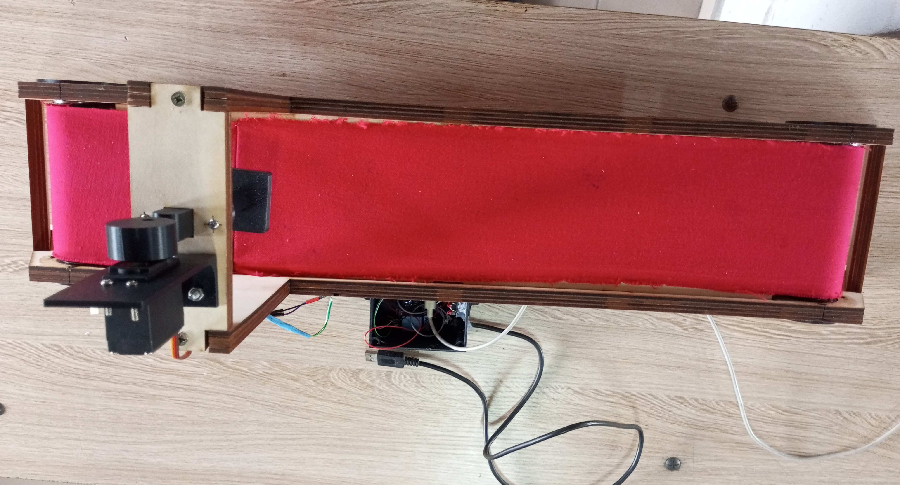

# Journal — Jeudi 17 septembre 2026 (rédigé par : ADAM Bilali)
## Etude de projet : Convoyeur à bande avec poste de marquage.
## Fait d'aujourd'huit :

## Finition :

- Réglage final du délai pour le marquage. 
- Maintenant le marquage est centré.
- Tests en boucle avec plusieurs pièces. Ca marche en automatique. Nettoyage du cablage.
- Finalisation du prototype

## Appris:

Le plus difficile c'est l'intégration mécanique + électronique + Programmation.
## Ratés :

- Petite usure de la bande après plusieurs heures de test.
- Le marquage est moins visible si la pièce est humide.
- Le capteur a du mal à capeter les pièces de couleur noires.